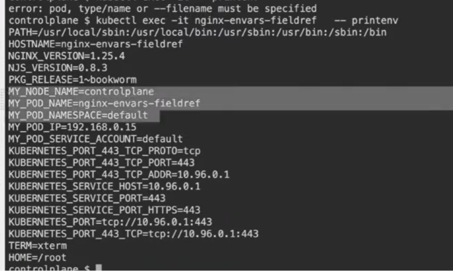

The output you shared shows the environment variables of a Pod named `nginx-envs-fieldref`. The error at the top (`error: pod, type/name or --filename must be specified`) was likely from a previous incomplete command (like just typing `kubectl exec -it` without arguments), which you fixed by running the full command.

However, the **real gold** in this output is the list of environment variables. Let me decode exactly what you are seeing and why it's there.

---

### 1. The Mystery: `MY_NODE_NAME`, `MY_POD_NAME`, etc.

Look at these specific variables:
```
MY_NODE_NAME=controlplane
MY_POD_NAME=nginx-envs-fieldref
MY_POD_NAMESPACE=default
MY_POD_IP=192.168.0.15
MY_POD_SERVICE_ACCOUNT=default
```

These **did not come from the Nginx image** by default. They were **injected into the Pod via the Downward API** using `fieldRef` in the Pod's YAML definition.

**What is the Downward API?**
It is a Kubernetes mechanism that exposes Pod metadata (like its name, namespace, IP, node name, and labels/annotations) to the containers inside the Pod without them having to call the Kubernetes API server.

**The YAML that created this** probably looks like this:

```yaml
apiVersion: v1
kind: Pod
metadata:
  name: nginx-envs-fieldref
spec:
  containers:
  - name: nginx
    image: nginx
    env:
    - name: MY_NODE_NAME
      valueFrom:
        fieldRef:
          fieldPath: spec.nodeName
    - name: MY_POD_NAME
      valueFrom:
        fieldRef:
          fieldPath: metadata.name
    - name: MY_POD_NAMESPACE
      valueFrom:
        fieldRef:
          fieldPath: metadata.namespace
    - name: MY_POD_IP
      valueFrom:
        fieldRef:
          fieldPath: status.podIP
    - name: MY_POD_SERVICE_ACCOUNT
      valueFrom:
        fieldRef:
          fieldPath: spec.serviceAccountName
```

---

### 2. The Default Variables: Kubernetes Service Environment

Look at these:
```
KUBERNETES_PORT_443_TCP=tcp://10.96.0.1:443
KUBERNETES_SERVICE_HOST=10.96.0.1
KUBERNETES_SERVICE_PORT=443
```



These are **automatically injected** by Kubernetes into every Pod. They represent the cluster's internal API server (the `kubernetes` service in the `default` namespace).

- **`KUBERNETES_SERVICE_HOST=10.96.0.1`**: This is the ClusterIP of the default Kubernetes service.
- **Why?**: This allows your application to talk to the Kubernetes API server without hardcoding the IP address, using environment variables like `${KUBERNETES_SERVICE_HOST}`.

---

### 3. The Standard Variables: Image and OS Defaults

```
PATH=/usr/local/sbin:/usr/local/bin:/usr/sbin:/usr/bin:/sbin:/bin
HOSTNAME=nginx-envs-fieldref
NGINX_VERSION=1.25.4
NJS_VERSION=0.8.3
HOME=/root
TERM=xterm
```

- **`PATH`, `HOME`, `TERM`**: Standard Linux environment variables set by the OS and the terminal.
- **`HOSTNAME`**: Automatically set to the Pod's name.
- **`NGINX_VERSION`, `NJS_VERSION`**: Set by the `nginx:1.25.4` image's `Dockerfile` to expose version information to the running application.

---

### 4. Why Use `fieldRef` (Downward API)?

| Without Downward API | With Downward API |
| :--- | :--- |
| Your app doesn't know its own IP, namespace, or node. | Your app knows exactly where it is running. |
| Hardcoding namespaces or node names is impossible. | Your app can tailor its behavior (e.g., logging the node it runs on, or registering itself in a service registry with its Pod IP). |

---

### 5. The `printenv` vs `env` Difference

In your command, you used `printenv`. This is a Linux command that prints all environment variables. `env` works similarly. The main difference is that `printenv` can take a specific variable name as an argument (e.g., `printenv MY_POD_NAME`), while `env` is more often used to run commands with modified environments.

---

### 💡 Summary of Your Output

| Category | Variables | Source |
| :--- | :--- | :--- |
| **Custom Injected** | `MY_NODE_NAME`, `MY_POD_IP`, etc. | **Downward API** (`fieldRef` in Pod YAML). |
| **Kubernetes System** | `KUBERNETES_SERVICE_HOST`, `KUBERNETES_PORT_*` | **Automatically injected** by Kubernetes for every Pod. |
| **Application Defaults** | `NGINX_VERSION`, `NJS_VERSION` | Set by the Nginx base Docker image. |
| **Linux/Shell Defaults** | `PATH`, `HOME`, `TERM`, `HOSTNAME` | Set by the operating system and shell. |