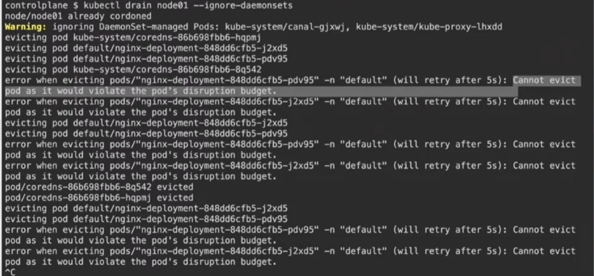

#### This is part 4 of the bootcamp

## another Sidecar container example 
https://github.com/thockin/kubectl-sidecar

## Pause container 
In Kubernetes when you launch a pod, there is also a pause container that gets spinned up. You can find the pauce.c file [here]()
ctr --namespace k8s.io containers list | grep pause

##PDB
Create deployment
Create pdb
Do rolling update

kubectl set image deployment/nginx-deployment nginx=nginx:1.16.1
kubectl get pods -w

###DownwardAPI
kubectl apply -f downwardapipod.yaml

It is use full when youu upgrade your node and there is important service which handle lot of traffic and many services are dependent on that service so that service is basically very critical for application we can loss the replica count of that service, in that we can configure PDB that prevent voluntery disruption of pod(during delete, drain, upgrade operations), if not set it can cause a a downtime, slowness, seviour impact on user experience etc

### QOS 
kubectl get pods nginx-guaranteed -oyaml | grep qos

