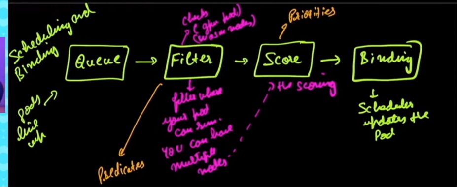
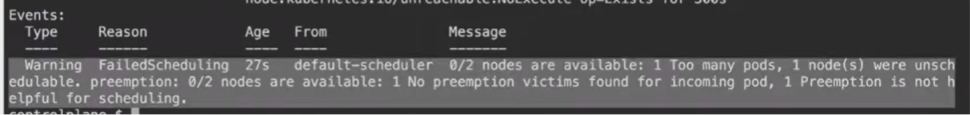
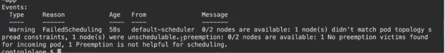
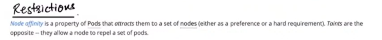

### Reference:
- https://kubernetes.io/docs/concepts/scheduling-eviction/scheduler-perf-tuning/



## Namespaces 

```
kubectl get ns 
kubectl create ns dev 
kubectl create ns bootcamp
kubectl create deploy demo -n bootcamp --image=nginx
kubectl create deploy demo -n dev --image=nginx 
kubectl config set-context --current --namespace=dev
```

### Resource quota and limit range example 
create the resourcequota and then limitrange then create a pod.

## Label and Selector

```
kubectl get nodes 
kubectl get ns 
kubectl run nginx --image nginx 
kubectl label pod nginx app=testing
kubectl get pods nginx --show-labels
```
## equity and set based 

```
kubectl get pod -l app!=nginx
kubectl create deploy bootcamp --image=nginx --replicas 3
kubectl get pods -l 'app in (test,bootcamp)'
```

## Priority class 
```bash
kubectl cordon controlplane
kubectl create deploy nginx --image=nginx --replicas=110
kubectl get po | grep -i pending
kubectl describe pod <pod_name>
```



```bash

```

## topolgy constraint
deploy yaml 
```
kubectl scale deploy demo-app --replicas 6
kubectl cordon controlplane
kubectl scale  deploy demo-app --replicas 7
kubectl scale  deploy demo-app --replicas 8 #This 8th pod be in pending

```


## Node affinity

kubectl label node controlplane topology.kubernetes.io/region=us-east-1



## taints and tolerations
kubectl taint nodes node01 app=demo:NoSchedule
