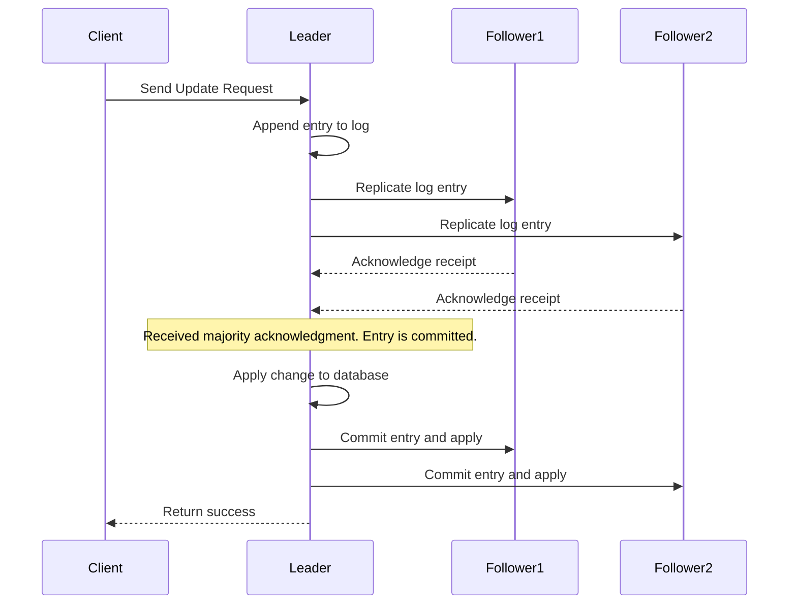

The algorithm used between etcd nodes to synchronize data and maintain consensus is the **Raft consensus algorithm** .

This algorithm is fundamental to how etcd operates as a strongly consistent, distributed key-value store .

### How Raft Works in etcd

Raft ensures that all nodes in the etcd cluster agree on the state of the data. It manages this through a few key mechanisms:

*   **Leader Election**: The cluster elects a single node as the **Leader**, which is responsible for managing all client requests and data replication. The other nodes become **Followers**. If the Leader fails, a new election occurs automatically .
*   **Log Replication**: This is the process for synchronizing data. When you write data to etcd, the following happens :
    1.  A client sends a write request to the Leader.
    2.  The Leader appends the request to its own log.
    3.  The Leader then sends the log entry to all Follower nodes.
    4.  The Followers receive the entry and acknowledge it.
    5.  Once the Leader receives confirmation from the **majority (quorum)** of nodes, the entry is considered "committed".
    6.  The Leader applies the change to its state machine and notifies the Followers to do the same, thus finalizing the write.

The diagram below illustrates a successful data write using the Raft algorithm:

### Why Raft is Important
etcd uses Raft to guarantee **strong consistency**. This means that a write operation is only successful when a majority of the nodes in the cluster have agreed to it. The Raft implementation in etcd is core to its function and cannot be replaced or configured to prioritize availability over consistency . This design is what makes etcd a reliable source of truth for critical data, like the state of a Kubernetes cluster.

The Raft algorithm is most efficient in small clusters, typically between 3 and 9 nodes. An odd number of nodes is recommended because it optimizes the cluster's ability to tolerate failures while still maintaining a majority .