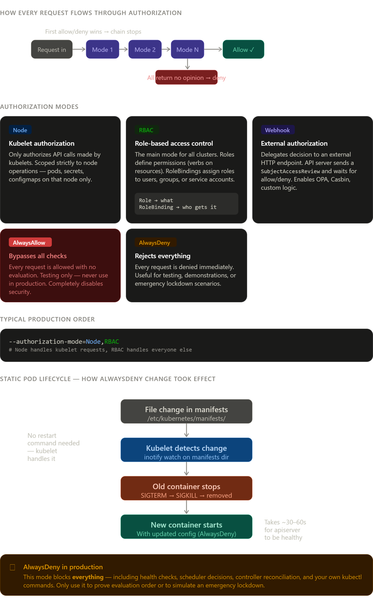

Now the complete deep-dive on each piece:

## Authorization Mode Evaluation — How It Actually Works

The API server evaluates modes in the **exact order you specify** in `--authorization-mode`. This is critical — `Node,RBAC` and `RBAC,Node` behave differently. The first mode to return an explicit allow **or** explicit deny wins and the chain stops. If every mode returns "no opinion" (abstain), the request is **denied by default** — Kubernetes fails closed, not open.

---

## Node Mode — BTS

Node mode is a special-purpose authorizer that only evaluates requests where the requester is a kubelet (identified by the credential format `system:node:<nodename>`). It then applies a fixed, hardcoded policy:

```
A kubelet can GET/LIST:
  - Its own Node object
  - Pods scheduled to its node
  - Secrets/ConfigMaps referenced by those pods
  - PersistentVolumeClaims attached to those pods

A kubelet CANNOT:
  - Read pods on other nodes
  - Read secrets not referenced by its pods
  - Modify anything it doesn't own
```

This prevents a compromised kubelet from reading secrets meant for pods on other nodes — a lateral movement defense. Without Node mode, you'd need RBAC rules to achieve this, but RBAC can't express "only pods on this specific node," so Node mode fills that gap.

---

## RBAC — How Evaluation Actually Happens

When a request hits RBAC, the authorizer runs this logic:

```
1. Identify the requester:
   - User: from client certificate CN field
   - Group: from client certificate O fields
   - ServiceAccount: from the mounted token

2. Find all RoleBindings/ClusterRoleBindings that include this identity

3. For each binding, get the referenced Role/ClusterRole

4. Check: does any role grant the requested verb on the requested resource?
   - verb: get, list, watch, create, update, patch, delete, deletecollection
   - resource: pods, secrets, services, etc.
   - namespace: for namespaced resources

5. If ANY binding grants it → allow
   If NONE grant it → abstain (not deny — RBAC never explicitly denies)
```

The crucial distinction: **RBAC only allows, never explicitly denies**. If no binding grants permission, RBAC returns "no opinion" and the next mode in the chain gets to decide. This is why AlwaysAllow after RBAC would make RBAC meaningless — anything RBAC didn't allow would get allowed by AlwaysAllow.

---

## Webhook Mode — The SubjectAccessReview Protocol

The API server sends a `SubjectAccessReview` object to your webhook endpoint:

```json
{
  "apiVersion": "authorization.k8s.io/v1",
  "kind": "SubjectAccessReview",
  "spec": {
    "user": "jane",
    "groups": ["system:authenticated"],
    "resourceAttributes": {
      "namespace": "production",
      "verb": "delete",
      "resource": "pods",
      "name": "critical-pod"
    }
  }
}
```

Your webhook responds with `allowed: true/false` and optionally a `reason`. The API server then honors that decision. This is how tools like **OPA/Gatekeeper** intercept authorization decisions before they reach RBAC — they can implement policies like "no one deletes pods in production between 9am-5pm on weekdays."

---

## Static Pod Lifecycle — Why No `systemctl restart` Was Needed

The `/etc/kubernetes/manifests/` directory is watched by kubelet using **inotify** — a Linux kernel subsystem that delivers filesystem event notifications (CREATE, MODIFY, DELETE, MOVE) to userspace without polling. The moment you write to `kube-apiserver.yaml`, the kernel sends an inotify event to kubelet's goroutine watching that directory. Kubelet then:

1. Parses the new YAML
2. Diffs it against the running pod spec
3. Stops the old container via the container runtime (containerd/cri-o)
4. Creates a new container with the updated spec

No manual intervention needed. This is the same mechanism that makes `kubectl apply` fast for static pods — the kubelet is always watching, always ready to reconcile.